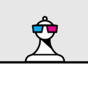

# Eugene Chess

Your next opponent is always ready.

**[Play Eugene Chess — free](https://adrian3.github.io/eugene-chess/)**

Sit down for a game against Eugene, a computer opponent with three difficulty settings and a simple board that keeps your attention on chess. Play as White or Black, try an idea, take it back, and see where the game leads.

## A game on your terms

- **Choose your challenge.** Switch between Easy, Normal, and Hard.
- **Learn by trying.** Take back your last move or ask Eugene for a suggestion.
- **Choose your side.** Play White or Black and select the piece when promoting a pawn.
- **Keep a game worth revisiting.** Save games or share the moves by email in PGN, the standard chess game format.

Choose a difficulty and a color to begin. A quick practice game or a longer battle is just a tap away.

## From the App Store to the web

Originally available on iOS as Eugene Chess and Eugene Chess HD, Eugene is now back as a free web app. **Eugene Chess HD reached 172,023 downloads** on the App Store.

*Lifetime iOS download totals (first-time downloads/purchases), from Ade’s App Store Connect export of September 29, 2026.*

## Keep it on your home screen

These are progressive web apps (PWAs): open the link above to play, or install the app from your browser for quick access with its own icon.

**iPhone or iPad**
1. Open the app in **Safari**.
2. Tap **Share** (you may need to open the **Page Menu** first), then **Add to Home Screen**.
3. Turn on **Open as Web App** if that option appears, then tap **Add**.
4. Launch it from your home screen.

**Android**
1. Open the app in **Chrome**.
2. Tap **⋮** → **Add to home screen** → **Install** (or **Install app**, depending on your browser).
3. Follow the prompts, then launch it from your home screen or app drawer.

Need help? See [Apple’s home screen instructions](https://support.apple.com/guide/iphone/open-as-web-app-iphea86e5236/ios) or [Chrome’s installation guide](https://support.google.com/chrome/answer/9658361?co=GENIE.Platform%3DAndroid&hl=en).

## Four ways to enjoy chess

Originally released for iOS, this family of chess apps is now available **free as PWAs** on phones, tablets, and computers.

| App | Find your next challenge |
| --- | --- |
| [Chess Puzzles](https://adrian3.github.io/chess-puzzles/) | Find the checkmate in 367 puzzles. |
| [Eugene Chess](https://adrian3.github.io/eugene-chess/) | Play against the computer at your own pace. |
| [Chess Server](https://adrian3.github.io/chess-server/) | Play live opponents and watch games on FICS. |
| [Grandmaster Archive](https://adrian3.github.io/grandmaster-archive/) | Replay classic games and learn from the greats. |

Designed and developed by **[Ade Hanft](https://adrian3.com)**.
